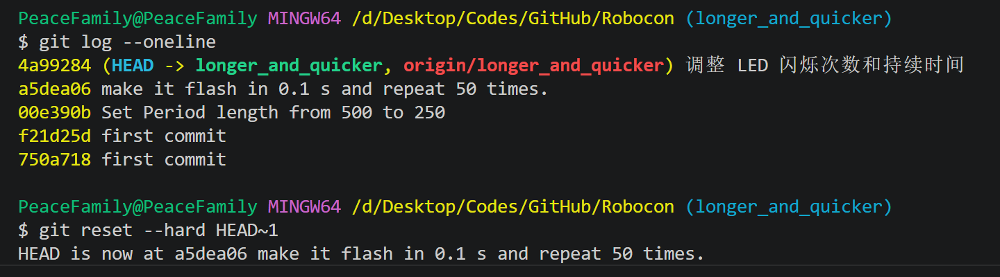
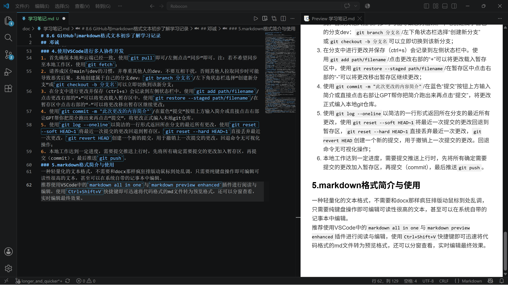

# 8.6 GitHub与markdown格式文本初步了解学习记录
## 邓诚
### 1. GitHub基本操作
 | 场景| Git Bash 命令| 作用说明 | VS Code 图形化操作 |
| :----------------- | :------------------------------------------------- | :-------------------------------------------- | :-------------------------------------------------------- |
| **创建本地仓库** | `git init` | 在当前文件夹初始化一个空的 Git 仓库，生成 `.git` 隐藏目录| 左侧「源代码管理」面板 → 「初始化仓库」按钮|
| | `git clone -b 分支名 git@github.com:用户名/仓库名.git` | 从远程克隆指定分支到本地，自动建立远程关联 | 左侧「源代码管理」→ `...` 菜单 → 「克隆」→ 粘贴仓库地址|
| **连接云端**| `git remote add origin git@github.com:用户名/仓库名.git` | 将本地仓库与远程仓库关联，`origin` 是远程仓库的默认别名| 左侧「源代码管理」→ `...` 菜单 → 「远程」→ 「添加远程仓库」→ 输入地址 → 命名为 `origin` |
|| `git push -u origin 分支名`| 首次推送本地分支到远程，并建立上游跟踪关系（以后可直接 `git push`）| 添加远程后，点击「发布分支 (Publish Branch)」按钮 |
| **同步云端到本地**| `git pull` | 从远程仓库拉取最新提交并自动合并到当前分支 | 左侧「源代码管理」→ `...` 菜单 → 「拉取」；或点击状态栏的同步图标|
|| `git pull --rebase origin main`| 以变基方式拉取远程更新，避免多余的合并提交（适合远程已有 README 等文件时首次同步） | 无直接对应按钮，需在终端手动执行 |
| **推送** | `git push` | 将当前分支的本地提交推送到远程仓库（需先建立上游跟踪）| 左侧「源代码管理」→ 点击「推送 (Push)」按钮；或 `...` 菜单 → 「推送」 |
|| `git push --set-upstream origin 分支名`| 首次推送新分支到远程，并建立跟踪关系| 新建分支后，直接点击「发布分支」按钮|
| **拉取** | `git pull` | 从远程获取最新更改并合并到当前分支 | 左侧「源代码管理」→ `...` 菜单 → 「拉取」|
|| `git fetch`| 从远程下载最新分支和提交信息，但不自动合并到本地工作区| `...` 菜单 → 「获取」|
| **查看更改**| `git status`| 查看当前工作区的文件状态：哪些被修改、哪些已暂存、哪些未跟踪| 左侧「源代码管理」面板直接显示变更文件列表（M = 修改，U = 未跟踪） |
|| `git diff` | 查看工作区中尚未暂存的具体修改内容 | 点击源代码管理面板中的某个文件，右侧自动打开 diff 视图（红删绿增） |
|| `git diff --cached`| 查看已暂存但尚未提交的具体修改内容 | 暂存后点击文件，diff 视图显示暂存区的变更|
| **暂存** | `git add 文件名` | 将指定文件的修改加入暂存区（Stage） | 点击文件右侧的「+」号；或悬停更改的文件点击「+」 |
|| `git add .`| 将当前目录下所有修改和新增文件加入暂存区 | 点击「更改」栏右侧的「+」号（暂存所有更改）|
|| `git restore --staged 文件名` | 将已暂存的文件移出暂存区（取消暂存）| 点击「已暂存的更改」栏中文件右侧的「-」号 |
|| `git checkout -- 文件名` | 丢弃工作区中对指定文件的修改（**危险：未暂存的修改会丢失**） | 右键点击文件 → 「放弃更改」|
| **分支** | `git branch 分支名`| 在本地创建新分支，但不切换过去| 左下角状态栏点击当前分支名 → 「创建新分支」|
|| `git checkout 分支名` | 切换到已存在的分支 | 左下角状态栏点击分支名 → 选择要切换的分支|
|| `git checkout -b 分支名` | 创建新分支并立即切换到该分支| 左下角状态栏 → 「创建新分支」→ 输入名称 → 自动切换 |
|| `git branch`| 列出本地所有分支，当前分支前有 `*` 标记| 左下角状态栏点击分支名，下拉列表显示所有分支|
|| `git branch -d 分支名`| 删除已合并的本地分支| 左下角状态栏 → 选择分支 → 「删除分支」|
|| `git branch -D 分支名`| 强制删除本地分支（无论是否已合并） | 终端手动执行|
|| `git push origin -d 分支名`| 删除远程仓库的指定分支| 在 GitHub 网页端删除，或终端执行 |
|| `git push origin --all`| 将所有本地分支推送到远程 | 逐个分支点击「发布分支」 |
| **检测分支与 main 的差异** | `git diff main 分支名`| 查看指定分支与 main 分支之间的代码差异| 左下角切换到目标分支 → 点击左侧「源代码管理」→ `...` → 「分支」→ 选择比较分支|
|| `git log main..分支名`| 查看目标分支上有、但 main 上没有的提交记录 | 左侧「源代码管理」→ 点击「图表」图标（Git 树）→ 观察分支分叉和提交差异|
| **列出过去的更改**| `git log` | 查看当前分支的完整提交历史（按 `q` 退出）| 左侧「源代码管理」→ 点击「图表」按钮，图形化显示提交树 |
|| `git log --oneline`| 以简洁的一行格式显示提交历史（含哈希缩写和提交信息）| Git 树中每个节点显示提交信息摘要|
|| `git log --graph --oneline --all` | 以图形方式展示所有分支的合并历史和提交记录 | Git 树视图直接以连线图展示分支合并关系 |
| **合并分支与 main** | `git checkout main`| 先切换到主分支（被合并的目标分支） | 左下角状态栏 → 选择 `main`|
|| `git merge 分支名`| 将指定分支的修改合并到当前分支（如 main）| `...` 菜单 → 「分支」→ 「合并分支」→ 选择要合并的来源分支|
|| `git merge --abort`| 合并过程中发生冲突时，放弃合并回到合并前状态| 冲突时点击「中止合并」按钮 |
| **回退更改**| `git reset --hard HEAD~1` | 回退到上一个提交，**丢弃**最近一次的提交和工作区更改（**危险操作**）| 终端手动执行（图形化无直接对应） |
|| `git reset --soft HEAD~1` | 回退到上一个提交，但保留更改在暂存区，可重新提交 | 终端手动执行|
|| `git revert HEAD` | 创建一个新的提交，用于撤销上一次提交的更改（安全，不破坏历史）| 终端手动执行|
|| `git log --oneline`| 查看历史以确定要回退到哪个版本| 点击「图表」按钮查看提交历史|
### 2.创建一个git仓库
1. 在指定路径打开git bash，输入`git init`初始化成一个.git文件夹，`git add .`将目录下所有文件同步到git仓库的暂存区中；
2. GitHub中创建一个仓库，设置好后连接方式选择SSH，并复制其后的路径（前提是本地已经登录GitHub并创建了SSH密钥）；
3. 使用`git push --set-upstream origin main`，打通上行通路，创建主支，推送文件；
4. 使用`git pull`下拉文件，确认无误即可。
### 3.在VSCode里创建一个git仓库
1. 文件->打开文件夹->选择路径->左侧“源代码管理”中选择“初始化仓库”->创建git仓库；
2. 添加远程，远程的地址和上文对应处一致；
3. 新建分支后点击“发布分支”；
4. 点击同步。
### 4.使用VSCode进行多人协作开发
1. 首先确保本地和云端已经一致，使用`git pull`即可/左侧点击“同步”即可。注：若不希望同步至本地工作区，使用`git fetch`；
2. 请养成区分main与dev的习惯，并尊重其他人的dev，不要互相干扰，否则其他人拉取同步时可能导致恶劣后果。本地创建属于自己的分支dev：`git branch 分支名`/左下角状态栏选择“创建新分支”或`git checkout -b 分支名`可以立即切换到该新分支；
3. 在分支中进行更改并保存（ctrl+s）会记录到左侧状态栏中。使用`git add path/filename`/点击更改右部的“+”可以将更改载入暂存区中，使用`git restore --staged path/filename`/在暂存区中点击右部的“-”可以将更改移出暂存区继续更改；
4. 使用`git commit -m "此次更改的内容简介"`/在蓝色“提交”按钮上方输入简介或直接点击右部让GPT帮你把简介跑出来再点击“提交”，将更改正式编入本地git仓库。
5. 使用`git log --oneline`以简洁的一行形式返回所在分支的最近所有更改，用于确定需要回退到哪里，使用`git reset --soft HEAD~1`将最近一次提交的更改回退到暂存区，`git reset --hard HEAD~1`直接丢弃最近一次更改，`git revert HEAD`创建一个新的提交，用于撤销上一次提交的更改。回退命令无可视化操作；

6. 本地工作达到一定进度，需要提交推送上行时，先将所有确定需要提交的更改加入暂存区，再提交（commit），最后推送`git push`。
### 5.markdown格式简介与使用
一种轻量化的文本格式，不需要和docx那样疯狂排版动鼠标到处乱调，只需要纯键盘操作即可编辑可读性很高的文本，甚至可以在系统自带的记事本中编辑。
推荐使用VSCode中的`markdown all in one`与`markdown preview enhanced`插件进行阅读与编辑，使用`Ctrl+Shift+V`快捷键即可迅速将代码格式的md文件转为预览格式，还可以分窗查看，实时编辑最终效果。

#### 其基础格式为：
| 效果         | 写法          | 示例                        |
| ---------- | ----------- | ------------------------- |
| **标题**     | `#` 号，1-6 级 | `# 一级标题` `## 二级标题`        |
| **粗体**     | 双星号         | `**粗体文字**`                |
| *斜体*       | 单星号         | `*斜体文字*`                  |
| ~~删除线~~    | 双波浪线        | `~~删除线~~`                 |
| `行内代码`     | 反引号         | `` `code` ``              |
| [链接](url)  | 方括号+圆括号     | `[百度](https://baidu.com)` |
|  | 链接前加叹号      | ``             |
| 引用         | `>` 符号      | `> 这是一段引用`                |
| 分割线        | 三个减号        | `---`                     |
##### 无序列表
- 苹果
- 香蕉
  - 子项（前面加两个空格缩进）
##### 有序列表
1. 第一步
2. 第二步
##### 代码块（可指定语言）
```python
print("Hello World")
```
##### 表格
| 姓名 | 年龄 | 城市 |
|------|------|------|
| 张三 | 25   | 北京 |
| 李四 | 30   | 上海 |

##### 实用技巧
换行：在行尾加两个空格，或直接空一行
转义字符：用反斜杠 \ 显示标记符号本身，如 \* 显示为 *
任务列表：- [ ] 待办 / - [x] 已完成
目录自动生成：很多编辑器支持 [TOC] 或右键生成目录